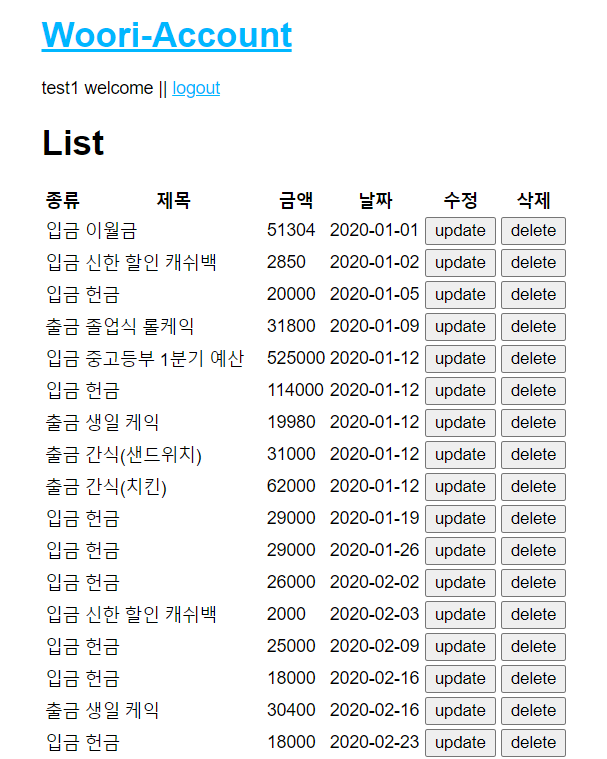
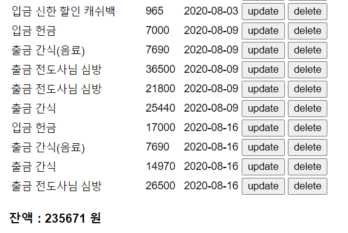
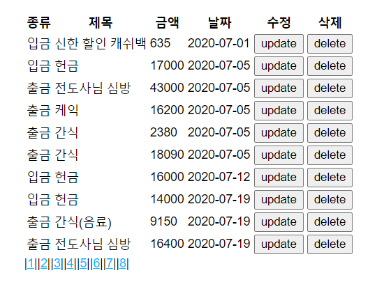

# Express-Account

계좌 정보를 저장하고 업데이트 할 수 있는 웹 애플리케이션

### 사용 기술

nodejs-express를 사용하여 구현하였음<br>
데이터베이스 : mysql<br>
화면출력 : pug(jade)를 사용해 간편하게 html을 구현<br>
로그인 : express의 passport 기능을 사용한 local login 구현<br>
회원가입 : bcryptjs 미들웨어를 사용해 중요 데이터를 암호화해 저장하여 관리자도 패스워드를 확인할 수 없도록 구현<br>
경고메시지 : flash를 사용해 세션에 기록된 메시지를 출력하고 삭제되도록 구현<br>
사용자권한 : 로그인 여부를 체크하는 함수를 구현해 로그인 하지 않을 경우 로그인 페이지로 강제로 이동시키도록 함<br>
사용자입력 : bodyparser 미들웨어를 사용해 post 방식으로 받은 데이터를 쉽게 파싱<br>

## 로그인 후 이용

로그인 후 서비스를 이용할 수 있도록 구현<br>
로그인 하지 않았을 경우 어떤 페이지로 들어가더라도 로그인 화면으로 이동<br>
<br>
로그인은 사용자의 id와 pw를 데이터베이스에 있는 사용자 정보와 조회해 일치할 경우 로그인 성공<br>
사용자 정보와 일치하지 않을 경우 경고메시지 출력<br>
<br><br>

##### 현재 로그인 상태 확인

request와 response를 매개변수로 받아 req.user의 존재 여부로 로그인이 상태를 알려줌

```javascript
isLogined: function (req, res) {
    if (req.user) {
      return true;
    } else {
      return false;
    }
  }
}
```

## 회원 가입

ID와 패스워드를 입력해 회원가입을 진행<br>
<br>
ID를 작성하지 않거나, 이미 존재하는 아이디일 경우, 패스워드를 작성하지 않거나, 두 개의 패스워드가 일치하지 않을 경우 상황에 맞는 경고메시지 출력<br>
새로고침 시 경고메시지 삭제<br>
<br>
<br>
<br>
회원 가입에 성공하면 로그인 화면으로 자동 이동<br>
회원 가입시 입력한 비밀번호는 암호화해서 저장
<br>

## 서비스

로그인에 성공하면 서비스를 사용할 수 있는 화면으로 이동
<br>
'계좌 보기'를 클릭할 경우 3가지 서비스를 선택할 수 있는 화면으로 이동<br>
화면 하단에는 잔액을 출력
<br>

## 입금내역 입력

입금 내역, 금액, 날짜를 입력받음<br>
<br>

## 출금내역 입력

출금 내역, 보내는 곳, 금액, 날짜를 입력받음<br>
<br>

## 거래내역

그동안의 거래 내역을 날짜순으로 출력<br>
거래 내역의 수정과 삭제를 할 수 있음
<br>
<br><br>

#### 페이징 소스코드

데이터베이스 LIMIT으로 구현하지 않고, 전체 데이터를 받아온 후 javascript를 통해 페이징 기능을 구현<br>
효율성과 지연 시간을 고려해 추후 데이터베이스 LIMIT으로 변경할 예정<br>

#### 2020.09.25

거래 내역이 너무 길게 나오는 불편을 해소하기 위해 페이징 기능을 통해 한 페이지에 10개씩 보여주기로 함<br>
<br>

#### 2020.09.25

데이터베이스의 부담을 줄이기 위해 LIMIT를 통한 페이징 구현<br>

```sql
(SELECT id,1 AS type,DATE_FORMAT(calen,'%Y-%m-%d') AS calen, title, price FROM income) UNION (SELECT id,2 AS type,DATE_FORMAT(calen,'%Y-%m-%d') AS calen, title, price FROM outcome) order by calen limit ${start}, 10`
```

```javascript
var page = parseInt(lists.length / 10);
if (lists.length % 10 !== 0) {
  page += 1;
}

var pageList = "";
for (i = 1; i <= page; i++) {
  pageList += `|<a href=/account/list/${i}>${i}</a>|`;
}

...
}
```
